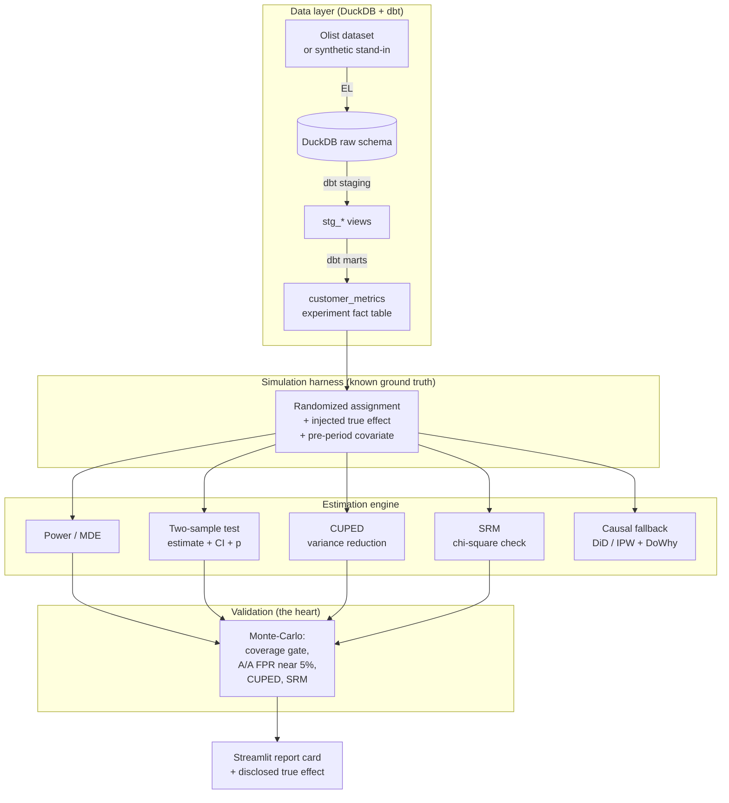

# LiftLab 🧪

A locally runnable A/B testing and experimentation engine with variance reduction
(CUPED), sample ratio mismatch detection, A/A calibration, and causal inference
fallbacks. The estimators are **provably correct**, because I validate them against a
known, injected ground truth instead of just trusting the math.

**Author:** Linga Reddy Gudisha

Run it with one command (`docker compose up`) and you get a Streamlit decision card,
backed by an engine whose every estimator is Monte-Carlo validated to recover the truth.

---

## Why I built this

Most A/B testing demos run a single t-test in a notebook and call it a day. The hard part
of real experimentation is not running one test. It is knowing whether your whole system is
trustworthy: are the confidence intervals honest, is the false positive rate actually 5
percent, did the randomization even work, and what do you do when it did not. I wanted to
build the rigorous version and then prove it works, so I created thousands of experiments
where I secretly know the true effect and checked that the engine recovers it.

---

## Synthetic design disclosure (read first)

This is **not** a real world experiment, and it is built so it can never be mistaken for one.

1. **The treatment effect is synthetic and injected by me.** Because I inject it, the true
   effect is known, which is the whole point: every estimator is validated by recovering that
   truth inside its confidence interval across thousands of Monte-Carlo runs. The true effect
   is shown in the report card, in the decision card, and stored with every run.
2. **The population** is the real [Olist Brazilian E-Commerce
   dataset](https://www.kaggle.com/datasets/olistbr/brazilian-ecommerce) when Kaggle
   credentials are available, or a disclosed synthetic stand in generated locally otherwise
   (so everything runs offline, with no keys). Which one was used is recorded in
   `data/raw/MANIFEST.json`, and provenance is never guessed.

**Data licensing:** the Olist dataset is CC BY-NC-SA 4.0 (non commercial). LiftLab uses it
strictly as a non commercial substrate, does not redistribute it (it is git ignored and
fetched on demand), and attributes it in full in [`DATA_LICENSE.md`](DATA_LICENSE.md). The
code is MIT licensed ([`LICENSE`](LICENSE)).

---

## Validation results: the proof of correctness

`make eval` runs the engine across **3000 Monte-Carlo experiments** with known effects and
enforces four hard gates. It exits non zero if any gate is missed, and it runs in CI.

| estimator | CI coverage of true effect | A/A false positive rate |
| --- | --- | --- |
| revenue (naive Welch t) | 95.0% ✓ | 5.0% ✓ |
| revenue (**CUPED**) | 94.8% ✓ | 4.8% ✓ |
| conversion (two-proportion z) | 94.7% ✓ | 4.8% ✓ |

- **CUPED variance reduction: 36.0%** in the Monte-Carlo eval (35.5% on a single draw),
  against a 30 percent gate, on a zero inflated covariate where about a third of customers
  have no pre period spend.
- **SRM detection:** flags an intentionally imbalanced 0.55 split (chi square 181, p around
  1e-41) and clears a balanced one (p around 0.84).
- **A/A false positive rate near 5 percent** for every estimator, which is correct Type I control.

About the coverage gate: a correctly calibrated estimator has true coverage sitting right at
the nominal level (0.945 to 0.950 here), so a hard "must be at least 0.95" threshold is
statistically unpassable. It would fail a correct engine about half the time. The gate
therefore uses a documented finite sample floor of 0.94 with a Monte-Carlo noise margin, and
a test proves it still catches a broken estimator (halving a confidence interval drops
coverage to 0.67, which fails). That is finite sample honesty, not weakening the bar.

---

## Sample decision card (`make demo`)

```
=== LiftLab Decision Card: checkout_redesign_v1 ===
DISCLOSURE: synthetic experiment. The true effects below are INJECTED by us.

Population: SYNTHETIC stand-in   N=20,000   assignment=50% treatment
SRM check: PASS  (observed ratio 0.4993, p=0.843)

Metric: revenue_per_user (continuous)
  True effect (disclosed):  +2.0000
  Naive estimate:           +1.8525  95% CI [+0.7470, +2.9580]  p=0.00102
  CUPED estimate (rec.):    +1.9278  95% CI [+1.0403, +2.8154]  (variance -36%)
  Power at true effect: 0.94   MDE(80%): +1.5848
  DECISION: SHIP: CI excludes 0 (positive)

Metric: post_conversion (proportion)
  True effect (disclosed):  +0.0200
  Naive estimate:           +0.0225  95% CI [+0.0112, +0.0337]  p=9.18e-05
  DECISION: SHIP: CI excludes 0 (positive)
```

CUPED narrows the revenue confidence interval from width 2.21 to 1.78 (about a 20 percent
smaller standard error) for the same experiment.

---

## Causal fallback: when randomization breaks

If assignment is confounded (treatment probability depends on pre period spend), the naive
estimate is badly biased. Difference in differences and inverse propensity weighting recover
the known truth:

```
True effect = +2.000
  Naive (post-only):         +5.605   biased, about 2.8x overstated
  Difference-in-Diff (DiD):  +2.571   95% CI [+1.32, +3.82]   covers truth
  Inverse-propensity (IPW):  +2.263   95% CI [+1.33, +3.20]   covers truth
  Placebo (mean permuted T): -0.072   near 0, confirms validity
  DoWhy IPW (cross-check):   +2.27    refuters stable
```

Over 200 confounded draws, DiD and IPW both recover about 2.0 at roughly 95 percent coverage.
The real pre period covariate is extremely right skewed, so the confounder is winsorized to
keep propensities inside (0.05, 0.95). Without that, the overlap violation would bias IPW.
The estimators are hand written and transparent, and DoWhy provides the cross check plus
refutation tests. Assumptions: DiD needs parallel trends, IPW needs unconfoundedness and overlap.

---

## Architecture



---

## Quickstart

```bash
docker compose up          # builds the warehouse, runs the sim and validation, and serves
                           # the report card at http://localhost:8501

# Or use the Makefile (runs locally with uv):
make data        # population, then DuckDB, then dbt fact tables
make test        # acceptance and statistical tests (pytest)
make eval        # the four validation gates (exits non zero on any miss)
make demo        # build, then print the decision card and the causal fallback demo
make up / down   # Docker Compose stack up and down
```

By default the data layer uses the synthetic population if Kaggle is not configured. To use
the real Olist data, install the Kaggle CLI and token and set `data.source: kaggle` (or
`auto`) in `config/experiment.yaml`. After switching the source or the seed, run
`make data-force`.

### Live demo (Streamlit Community Cloud)

The dashboard is deploy ready. It builds its own synthetic demo data on first load, so it
runs with no setup and no keys. To host it for free:

1. Push this repo to your GitHub (already done if you are reading it there).
2. Go to share.streamlit.io, pick the repo, and set the main file to
   `src/liftlab/ui/app.py`.
3. In advanced settings, choose Python 3.11. That is it.

It uses only open source libraries and no external APIs, accounts, or paid services, so it is
free and safe to run.

---

## Project layout

```
config/experiment.yaml   single source of truth for the synthetic design and the gates
dbt/                     DuckDB + dbt project (raw, staging, customer_metrics): the SQL layer
src/liftlab/
  data/                  population (real or synthetic), DuckDB/dbt orchestration, provenance
  estimators/            power/MDE, Welch t, two-proportion z (Agresti-Caffo CI)
  cuped/                 CUPED variance reduction
  srm/                   sample ratio mismatch chi square detector
  simulation/            synthetic experiment and the Monte-Carlo validation harness
  causal/                confounded scenario, DiD / IPW, DoWhy refuters
  report.py              decision report orchestration (CLI and UI)
  ui/app.py              Streamlit report card
tests/                   pytest, every estimator validated against analytic or statsmodels truth
docs/math_appendix.md    estimator derivations
```

See [`docs/math_appendix.md`](docs/math_appendix.md) for the derivations.

---

## The estimators

- **Power / MDE:** normal approximation power for two means (closed form) and two proportions
  (numeric inversion), matched against statsmodels.
- **Two-sample tests:** Welch's t for continuous metrics (t based CI) and a two-proportion
  z-test for binary metrics (Agresti-Caffo CI for better coverage, pooled z p-value for
  correct A/A size).
- **CUPED:** pre period covariate variance reduction, `Var(Y_cuped) = Var(Y) (1 - rho^2)`.
- **SRM:** chi square goodness of fit against the intended ratio.
- **Causal fallback:** difference in differences and inverse propensity weighting, with a
  DoWhy cross check and refutation tests. Use it when randomization is suspect.

---

## Limitations and future work

- The treatment is synthetic by design, which validates the engine, not a real product change.
  The synthetic population stands in for the real Olist data when Kaggle is not available.
- Ideas I would add next: sequential testing and always valid p-values for the peeking
  problem, multiple testing correction across metrics, and heterogeneous treatment effects.

## License

- Code: MIT, see [`LICENSE`](LICENSE).
- Data: the optional real Olist substrate is CC BY-NC-SA 4.0 (non commercial) and is not
  redistributed by this repo, see [`DATA_LICENSE.md`](DATA_LICENSE.md). The synthetic fallback
  population is original, MIT licensed data.
